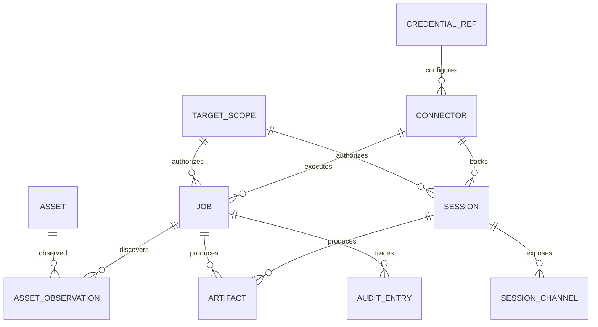

# 领域模型与持久化

> 文档状态：`accepted`  
> 默认实现规划：本地 SQLite + 文件 Artifact Store  
> 决策：[ADR-0009](../adr/ADR-0009-global-application-data.md)

## 1. 数据边界

采用本机单用户、应用级全局业务数据。资产、任务、产物和会话可直接查询，不需要选择业务项目，也不设置隐藏的默认项目。业务 ID 是不透明字符串；时间统一使用 UTC RFC 3339。

`TargetScope` 是独立的全局授权记录，约束主动操作，不是数据容器。应用级策略给出允许操作与资源上限，Scope 只能进一步收紧约束。资产不按 Scope 分区：同一规范化资产可以来自多个任务，通过观测记录追溯任务、来源和当时的授权范围。

当前没有业务数据库，本次调整的是未发布的业务模型，不执行旧数据合并或迁移。后续数据库第一次初始化直接创建下述结构；不存在用于兼容旧项目概念的表、参数或默认 ID。

## 2. 核心对象

| 对象 | 作用 | 关键字段（概念） |
| --- | --- | --- |
| `TargetScope` | 授权目标与操作限制 | `id`、名称、目标表达式、授权说明、状态、生效/过期时间、风险等级、允许操作、修订号 |
| `Asset` | 全局归一化主机、服务、域名、URL 或设备 | `id`、类型、规范化值、标签、首次/最近发现时间 |
| `AssetObservation` | 资产的来源和一次观测 | `id`、`assetId`、`jobId`、来源、时间、观测摘要 |
| `Job` | 可查询、可取消的长操作 | `id`、领域、类型、状态、进度、请求摘要、可选 `targetScopeId`、Scope 修订摘要、错误、时间戳 |
| `Artifact` | 能力或会话产生的持久化产物 | `id`、媒体类型、存储键、哈希、大小、来源、保留期 |
| `Session` | 与远端对象的持续连接 | `id`、连接器、授权范围引用、远端摘要、状态、心跳、创建/关闭时间 |
| `SessionChannel` | Session 的命令、文件或终端通道 | `id`、类型、能力、状态、最后活动时间 |
| `Connector` | 外部工具或协议的配置和健康信息 | `id`、领域、类型、版本、配置引用、状态 |
| `CredentialRef` | 系统密钥库中的秘密引用 | `id`、提供者、外部 key、用途、创建/轮换时间 |
| `AuditEntry` | 可追溯的动作记录 | actor、入口、目标、动作、结果、时间、可选 Scope/Job/Session/Artifact/request 关联 ID |

主动扫描类 Job 必须关联有效 Scope；本地分析类 Job 是否需要 Scope 由其领域和风险策略决定。授权通过不等于存在可用 Connector。Scope 的修改、到期或撤销不删除历史 Job、AssetObservation、Artifact 或 AuditEntry；历史保留授权修订和脱敏摘要，不能用 Scope 的现值重新解释过去的授权。

## 3. 关系



图中的授权关系适用于需要 Scope 的操作，不要求低风险查询和本地处理生成 Scope。审计还可记录未产生 Job 的拒绝、Scope 修改和策略变更。

## 4. 状态机

### 4.1 Job

```text
queued -> running -> succeeded
                 -> failed
                 -> cancelled
queued -> cancelled
queued/running -> interrupted  (进程异常退出)
```

Job 固定六态：`queued / running / succeeded / failed / cancelled / interrupted`。提交前授权拒绝返回错误 envelope 并记录审计，不产生第七个状态。已创建任务遇到运行期授权失效按领域策略停止并进入 `failed`，附稳定错误 code；显式取消走 `cancelled`。

- `queued` 和 `running` 可请求取消；取消结果以重新查询后的后端状态为准。
- `interrupted` 表示进程未确认清理，默认不自动重试；领域可声明安全恢复策略。
- 进度是可重新查询的快照，事件仅提示查询，不是可靠高频事件存储。
- 结果引用 Artifact 或领域记录，Job 本身不塞入大文本。

### 4.2 Session

```text
connecting -> online -> idle -> busy -> idle
     |          |        |       |
     +--------> dead <---+-------+
online/idle/busy -> closing -> closed
```

连接器可以报告 `dead`，但只有明确关闭动作或清理策略才进入 `closed`。心跳和最后错误必须可查询；原始会话输出按策略保存。Scope 撤销后拒绝新命令，并由会话策略关闭或降为只读，不删除会话历史。

### 4.3 Artifact

```text
writing -> available -> expired -> deleted
                    -> quarantined
```

即使内容过期或删除，Artifact 元数据仍可保留，确保审计和结果索引可追溯。

## 5. SQLite 与存储端口

计划的逻辑表如下，具体列和索引在业务实现前确认：

```text
application_policies
target_scopes
target_scope_revisions
assets
asset_observations
jobs
job_artifacts
artifacts
connectors
credential_refs
sessions
session_channels
audit_entries
schema_migrations
```

资产唯一性在应用级按类型与规范化值等领域键判断，不使用 Scope 分区键。Job、Session 和观测按 ID、时间、状态和来源查询；Scope 可作为来源筛选条件，但不成为必填查询上下文。

领域依赖 `TargetScopeRepository`、`AssetRepository`、`JobRepository`、`SessionRepository`、`ArtifactMetadataRepository`、`ApplicationPolicyStore`、`AuditWriter / AuditReader`、`ArtifactStore` 和 `SecretStore` 等端口，不依赖驱动。SQLite 保存元数据、状态、索引和小型摘要；扫描原始输出、日志、pcap、镜像及导出包写入 Artifact Store。

## 6. 业务配置与 GUI 配置

| 内容 | 存储 | 原因 |
| --- | --- | --- |
| Scope、资产、Job、Session、应用级策略和审计 | SQLite | 查询、审计和跨入口共享 |
| Artifact 内容 | 文件系统/对象存储 | 独立哈希与保留策略 |
| 凭据 | OS keychain | 数据库只保存引用 |
| 主题、语言、布局、侧边栏偏好 | 经 storage 模块访问的 localStorage | GUI 专属，不影响 CLI/MCP |
| 当前所选 Scope、业务表单草稿、查询快照、界面通知 | 运行时内存 | 不持久化业务上下文或未提交内容 |

## 7. 重启、清理和保留

- 启动时将未结束的 `queued/running` Job 标记为 `interrupted`，再由领域决定能否恢复。
- 关闭时停止接收新任务，给连接器和 Artifact 写入器有限的清理窗口。
- 审计默认长期保留，敏感 detail 脱敏；具体保留期由应用级策略配置。
- Scope 只约束权限，撤销不触发资产、任务、产物或审计的级联删除。
- Session 原始终端输出和临时文件有明确 TTL；Artifact 清理先写审计，再删内容，元数据可保留为 `expired/deleted`。

## 8. 备份与迁移

SQLite 与 Artifact 目录使用同一快照标识。恢复先校验 schema version、引用完整性、Artifact 哈希和路径安全，再开放入口。备份包括全局 Scope 与策略，排除秘密本体和 GUI 草稿；恢复后重新验证密钥库引用与授权有效期。

后续 schema 迁移有递增版本、幂等检查和失败回滚。外部数据库适配不得改变领域 ID 和入口契约；当前尚未发布业务存储，因此本轮没有数据合并迁移任务。
