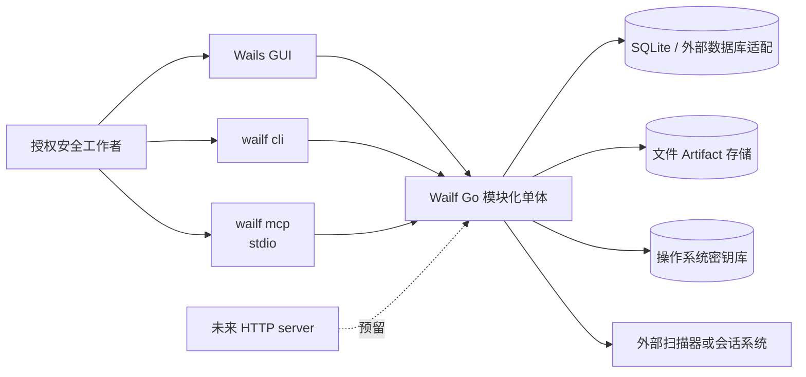
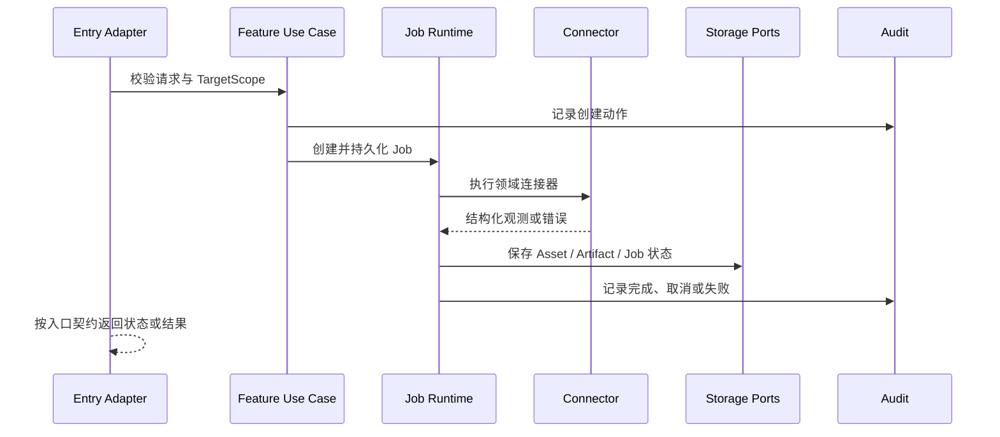

# Wailf 架构总览

> 文档状态：`accepted`  
> 目标：为后续 Go、Vue 和入口适配实现提供唯一的结构约束

## 1. 一句话架构

Wailf 是一个本地优先的 Go 模块化单体：领域能力按垂直切片组织，平台层提供存储、Job、Artifact、审计和秘密引用等基础设施，Wails GUI、CLI、MCP 和未来 HTTP 分别通过适配层调用需要的领域用例；GUI 另有独立的平台主题适配层。

共享的是业务模型、持久化和算法；不共享一个包罗万象的 Capability 接口、Engine 门面或全局事件总线。

## 2. 系统上下文



GUI 是本地 WebView，不是业务服务端。CLI 和 MCP 在同一个可执行文件中选择不同启动模式；它们不通过 GUI 页面间接调用能力。`PlatformProvider`、`ThemeService` 和 `ThemeStorage` 只在 GUI 初始化，主题偏好不会进入 CLI、MCP、HTTP/server 或领域数据。

## 3. 运行模式

| 模式 | 入口 | 进程职责 | 首期状态 |
| --- | --- | --- | --- |
| GUI | 无参数或 GUI 启动模式 | 创建 Wails 窗口并注册 GUI 适配服务 | 当前脚手架已有 |
| CLI | `wailf cli <command>` | 解析参数、调用领域用例、输出 JSON/文本和退出码 | 架构已定 |
| MCP | `wailf mcp` | 启动 stdio MCP 服务器，注册精选工具 | 架构已定，SDK 待定 |
| Server | `wailf server` 或现有 server build profile | 提供无 GUI HTTP 访问 | 预留 |

所有模式都由同一个 composition root 组装平台依赖和领域模块。入口只决定适配器、日志输出和生命周期，不复制业务规则。

## 4. 目标代码布局

```text
cmd/wailf/
  main.go                         # 启动模式选择与 composition root
internal/
  platform/
    config/                       # 配置来源与校验
    storage/                      # SQLite、迁移、repository ports
    jobs/                         # Job 运行时、取消、进度和恢复标记
    artifacts/                    # 文件产物、哈希、清理和下载引用
    audit/                        # 审计写入和查询
    secrets/                      # 系统密钥库适配与 credential reference
  features/
    scope/
    asset/
    recon/
    scan/
    session/
    artifact/
  adapters/
    wails/                        # Wails service 与 DTO
    cli/                          # Cobra 命令与 CLI 输出
    mcp/                          # MCP tool 注册与输入校验
    http/                         # 未来 HTTP handler
frontend/src/                     # 具体前端目录遵循前端开发规范，不在此重复定义
```

前端目录和组件规则唯一来源为[前端开发规范](../development/frontend-conventions.md)。采用本机单用户全局数据，Scope 独立授权，不是业务对象的隔离容器；详见[领域模型](domain-model-and-storage.md)。目录是边界提示，不要求每个小功能都创建一层空目录。只有拥有独立模型、流程或入口契约的领域才建立垂直切片。

## 5. 依赖方向

```text
入口适配器 -> 领域用例/查询 -> 领域模型
                         -> 平台端口
平台适配器 -> 平台端口
```

- `features/*` 不导入 Wails、Cobra、MCP SDK、HTTP handler 或 Vue 类型。
- 领域可以依赖平台端口（例如 `JobStore`、`ArtifactStore`、`AuditWriter`），不能依赖某个具体 SQLite 或外部工具实现。
- 入口适配器可以组合多个领域用例，但不能直接操作 repository 或绕过授权检查。
- 领域之间不通过全局事件总线互相调用；跨领域协作使用明确的查询端口、命令结果或 Artifact 引用。
- 运行时通知是入口适配器的传输细节，不是所有领域都必须实现的统一事件协议。

GUI 平台主题是前端平台层的局部依赖，不改变上面的领域依赖方向：`PlatformProvider` 读取 Wails runtime 的环境描述，`ThemeService` 按 `base -> platform -> user` 应用 schema v1 token，并保留独立的 `data-platform` chrome hooks，`ThemeStorage` 只读写版本化 GUI 偏好。平台探测使用异步超时和默认回退，资源从随包 allowlist/manifest 加载；任何失败都不能阻塞 AppShell。详细契约见[主题与平台适配](theme-and-platform.md)。

## 6. 典型数据流



## 7. 设计底线

- 业务规则只能有一份，入口适配代码可以重复。
- 长操作不阻塞 GUI、CLI 或 MCP 请求线程；查询类操作保持同步。
- 凭据不进入普通 DTO、日志、localStorage 或 Artifact 内容索引。
- 外部工具失败必须转化为可诊断的领域错误和 Job 状态，不能只写一行日志。
- server 模式不是默认的远程控制面；启用 HTTP 前必须补齐认证、TLS、来源和数据隔离设计。

- 主题是 GUI-only 表现层能力，不得影响领域结果、Job、审计、日志、CLI stdout/stderr 或 MCP schema。
- 平台 token、chrome hook 和用户 token 必须分层；用户输入只能覆盖受控语义 token，不能注入选择器、任意 CSS、`url()`、`@import` 或脚本。
- 主题资源必须随 Wails 包发布；`@wailsio/runtime` 与 Go Wails 版本精确锁定，当前基线为 `v3.0.0-beta.20`，禁止依赖 `latest`。

## 8. 关联决策

- [ADR-0001：模块化单体与入口适配](../adr/ADR-0001-模块化单体与入口适配.md)
- [ADR-0003：Job 异步语义](../adr/ADR-0003-Job异步语义.md)
- [ADR-0006：入口不对称与不设统一门面](../adr/ADR-0006-入口不对称与不设统一门面.md)
- [ADR-0008：平台主题与用户主题分层](../adr/ADR-0008-平台主题与用户主题分层.md)
- [主题与平台适配](theme-and-platform.md)
