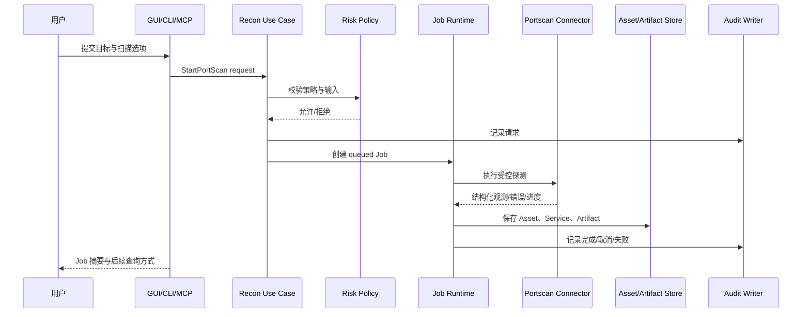

# 首个垂直切片：资产侦察与端口扫描

> 文档状态：`designing`
> 目标：验证 Wailf 的第一个领域切片、Job、Artifact 和三入口适配

## 1. 范围

### 包含

- 从 CIDR、主机、域名或已有 Asset 集合创建扫描输入；
- 通过可替换的扫描器 Connector 执行端口/服务探测；
- 将外部结果归一化为 Asset、Service observation 和 Artifact；
- 查看 Job 状态、进度、失败原因、取消结果和审计记录；
- GUI、CLI、MCP 各自暴露约定的子集。

### 不包含

- 绕过策略或隐蔽扫描；
- 漏洞利用、口令攻击、C2 Agent 或 WebShell 植入；
- 把某一个外部扫描器的原始字段直接当成公共领域模型；
- 首期远程 HTTP 控制面和多用户审批流。

## 2. 前置条件

开始 Job 前必须满足：

1. 请求输入能归一化为目标表达式；
2. Connector 已配置、健康检查通过并声明版本；
3. profile 与并发设置符合领域约束。

任一条件不满足时，不创建运行中的 Job；可以创建带原因的审计记录，便于用户修正配置。

## 3. 端到端流程



## 4. 概念请求与结果

启动请求不是公共 Go 接口，而是三入口都可以转换到的领域意图。以下 profile 仅为设计示例，GUI 的可选值由真实服务提供，不作为内置可用扫描器或配置：

```json
{
  "targets": ["example.invalid"],
  "profile": "safe-service-discovery",
  "connectorId": "connector_opaque_id"
}
```

结果至少包含：

- 一个 Job 摘要和可查询的状态；
- 规范化目标 Asset（主机、域名、URL 或设备）；
- Service observation（端口、协议/服务标识、发现时间和来源）；
- 外部原始结果对应的 Artifact 引用（若策略允许保留）；
- 统计摘要和可诊断的失败项；
- 关联的 AuditEntry。

入口不得把认证信息、原始命令行参数中的秘密或未脱敏输出写进结果。

## 5. Connector 边界

`PortscanConnector` 是 recon/scan 领域的端口，不属于平台通用 Capability。它需要声明：

- 支持的输入类型和 profile；
- 版本、健康状态和能力限制；
- 超时、取消和子进程清理行为；
- 结构化结果映射和无法解析的原始片段处理；
- 资源上限和并发建议。

领域服务负责策略、Job 和归一化；Connector 负责与具体工具或协议交互。更换外部工具不应改变 Asset、Job 和 Artifact 的公共字段。

## 6. 三入口示例

### GUI

GUI 页面分为目标输入、profile/Connector 选择、运行状态和任务关联结果。启动后立即显示 Job 摘要，TaskPanel 可以在不离开当前页面的情况下查看进度和取消。

当前仅实现前端流程，默认服务返回未接入；用户可编辑本次运行的目标草稿，保存、提交、取消、业务导出不可用并说明原因。Connector/profile 不生成演示选项。

### CLI

概念命令形态：

```text
wailf cli recon portscan --input targets.txt --output json
```

stdout 返回 Job JSON，stderr 只输出诊断；用户使用 `job get` 或 `job wait` 获取完成结果。命令不会读取 GUI 布局或绕过领域策略。

### MCP

使用聚合工具提交扫描任务，返回 Job 摘要和下一步查询建议。工具描述必须限制输入大小、目标范围和输出体积；MCP 默认不能直接执行任意外部命令。

## 7. 失败与恢复

| 场景 | Job 结果 | 处理 |
| --- | --- | --- |
| 输入不符合约束 | 不创建 Job，返回输入错误 | 提示修正目标或配置 |
| 运行期间策略变化 | 按策略停止，状态为 `failed` | 保存已获结果，附稳定错误 code，不删除历史 |
| Connector 不健康 | `failed` | 保留健康检查和诊断 detail，可更换 Connector 重试 |
| 用户取消 | `cancelled` | 尝试清理外部进程，记录清理结果 |
| 进程异常退出 | `interrupted` | 下次启动不自动重扫，允许用户显式恢复/新建 |
| 部分目标失败 | `succeeded` 带 warning 或 `failed` | 保存逐目标结果和统计，不丢弃成功项 |
| Artifact 写入失败 | `failed` 或降级为摘要 | 不宣称完整结果，记录缺失产物 |

## 8. 验收标准

- 同一领域规则可由 GUI、CLI 和 MCP 分别调用，业务结果一致但协议不同。
- 未通过策略检查时，三入口都拒绝启动扫描。
- Job 状态在重启后可解释，取消不会留下未清理的外部进程。
- 外部工具字段变更只影响 Connector 映射，不影响 Asset/Job/Artifact 查询契约。
- 结果、原始产物、审计和敏感信息的存储位置符合 [领域模型与持久化](../architecture/domain-model-and-storage.md) 和 [安全与治理](../security/governance.md)。
- 使用 fake Connector 可以在没有真实网络目标的情况下完成领域、存储和入口契约测试。
